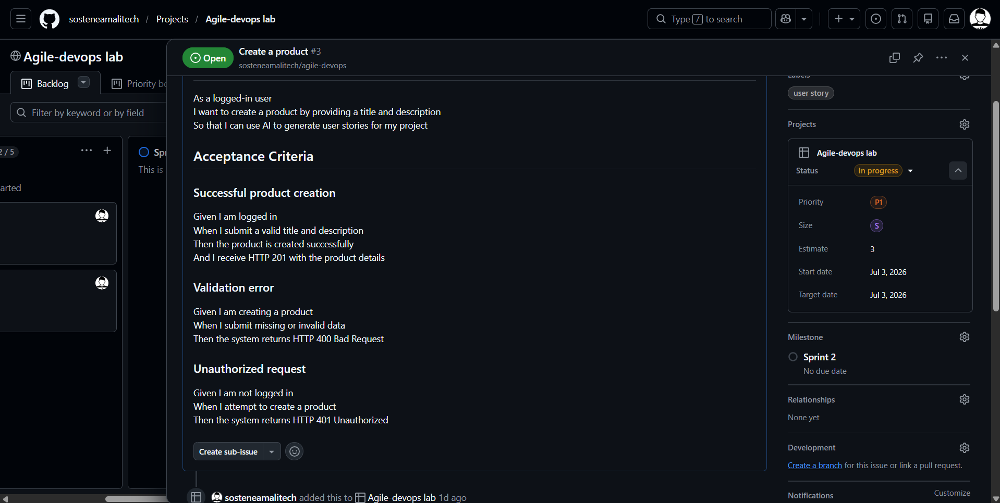
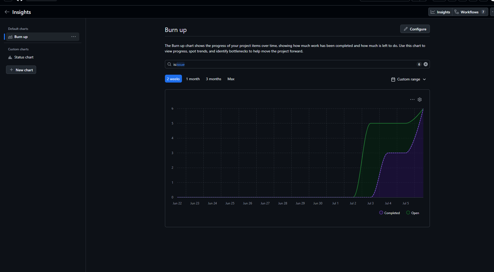
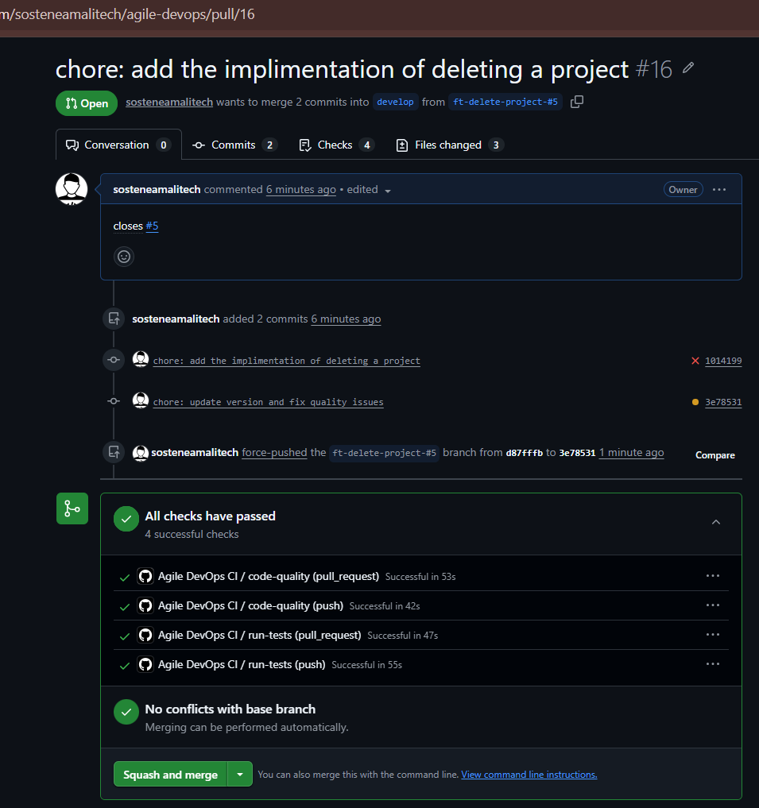
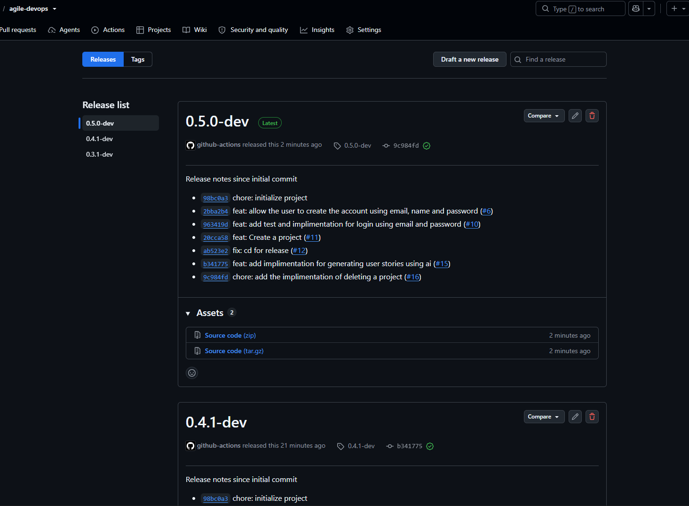

# Final Assessment: Agile & DevOps in Practice
**Project Repository:** [sosteneamalitech/agile-devops](https://github.com/sosteneamalitech/agile-devops)  
**Project Board:** [GitHub Project Tracking](https://github.com/users/sosteneamalitech/projects/1)


## Product Vision
I built a simple web service using Python and FastAPI that connects to an AI API. It automatically creates full user stories and testing rules from a basic project title and description to save time for project managers.


## Agile Practice

### Why I Chose Github Project as project management tool
Since I worked on this project alone, I needed an ecosystem that kept my code and project tracking in one single place. I chose **GitHub Projects** because Jira does not easily allow free, fully open public project tracking without heavy setup.
### Definition of Done (DoD)
I marked a task "Done" only when it met these specific rules:
1. All testing steps passed locally with no errors.
2. The code was clean, readable, and matched standard style rules.
3. A Pull Request was opened and passed all automated checks on GitHub.
4. The code was successfully mixed into the main project branch.
5. GitHub Actions automatically created a new version tag.
6. The task card was moved to the "Done" column on my project board.

### Sprint Map and Backlog Tracking
All user stories can be found actively tracked within the GitHub Project board. The table below outlines how each story was estimated, prioritized, and mapped to its respective sprint planning phase, alongside its corresponding GitHub Issue and Pull Request (PR):

| Issue / PR Links | User Story | Priority | Sprint Allocation | Estimate |
| :--- | :--- | :--- | :--- | :--- |
| [Issue #1](https://github.com/sosteneamalitech/agile-devops/issues/1) / [PR #6](https://github.com/sosteneamalitech/agile-devops/pull/6) | As a new user, I want to create an account so that I can log in safely. | Must Have(P0) | Sprint 1 Planning | 5 SP |
| [Issue #2](https://github.com/sosteneamalitech/agile-devops/issues/2) / [PR #7](https://github.com/sosteneamalitech/agile-devops/pull/10) | As a user, I want to log in with my email and password to access my data. | Must Have(P0) | Sprint 1 Planning | 3 SP |
| [Issue #3](https://github.com/sosteneamalitech/agile-devops/issues/3) / [PR #8](https://github.com/sosteneamalitech/agile-devops/pull/11) | As a logged-in user, I want to create a project with a title and description. | Must Have(P0) | Sprint 1 Planning | 3 SP |
| [Issue #4](https://github.com/sosteneamalitech/agile-devops/issues/4) / [PR #9](https://github.com/sosteneamalitech/agile-devops/pull/15) | As a logged-in user, I want to generate user stories for my project using AI. | Must Have(P0) | Sprint 2 Planning | 13 SP |
| [Issue #5](https://github.com/sosteneamalitech/agile-devops/issues/5) / [PR #10](https://github.com/sosteneamalitech/agile-devops/pull/16) | As a logged-in user, I want to delete a project to clean up my dashboard. | Could Have(P2) | Sprint 2 Planning | 2 SP |

---

### Sprint Planning Execution
- **Sprint 1 Commitment:** Issue #1, Issue #2, and Issue #3. Total: 11 points.
- **Sprint 2 Commitment:** Issue #4 and Issue #5. Total: 15 points.
- **Sprint Duration:** Each sprint was executed over exactly 2 days to maintain focused momentum, with quick status check-ins held every 8 hours to keep development on track.

#### Sprint 1 User Stories and Acceptance Criteria

##### Issue #1: Create account
- **Scenario 1:** Valid information is sent, account is created, and server returns code 201.
- **Scenario 2:** Bad or missing information is sent, server returns code 400.
- **Scenario 3:** Email already exists in system, server returns code 409.


##### Issue #2: Login using email and password
- **Scenario 1:** Valid email and password are sent, user logs in, and gets a token back.
- **Scenario 2:** Wrong email or password is sent, login fails, and server returns code 401.


##### Issue #3: Create a product
- **Scenario 1:** Logged-in user sends a clear project title and description, project is made, and server returns code 201.



---
## Sprint Reviews and Retrospectives

## Sprint 1 Review 
I finished Sprint 1 on time. All three committed tasks moved completely to the "Done" column on my project board. I verified the endpoints using automated tests and quick manual curl requests.
- **Value delivered:** presonalized user accounts, user login , and creating a basic project.


### Why I Changed My Process After Sprint 1
During my Sprint 1 review, I noticed that creating version tags by hand took too much time and caused messy release naming. Since I was working completely alone, I needed my tools to protect my delivery quality. I made two direct changes for Sprint 2 based on what I learned:
1. **Version Check Action:** I updated my GitHub Actions file to run an automated version check during code delivery. This made sure every single release tag strictly matched my internal version config.
2. **Monitoring Route:** I added a health check feature via the `GET /health` path to let me view system status without looking directly at backend server code.

---

## Sprint 2 Review
I finished Sprint 2 successfully by completing both chosen tasks on my board. My automated tests passed, and the AI engine successfully built stories over the API.
- **Value delivered:** Core AI user story generation tools and lightweight monitoring paths.


### Velocity Analytics
My burnup chart shows my progress over the 2-day sprint timeframe. The middle flat spot happened because I spent extra time testing my custom AI prompt rules. As soon as the connection worked, my work line caught back up to the target scope line quickly.



### What I Will Improve Next (Sprint 2 Retrospective)
Looking closely at my Sprint 2 review, I found two new improvements I can make to grow my skills in future cycles:
- **Strict Version Rules:** I want to update my pipeline code to check that the previous version number is always strictly less than the new version tag. This will stop accidental version mix-ups.
- **Proper User Interface:** While my curl setup works great for developer testing, the next big process step is building a real web UI page to make the application easy for non-technical users to try.

## DevOps Practice

### Why I Chose Python and FastAPI
I chose **Python** because its extensive ecosystem for AI integration perfectly aligned with my product vision of generating user stories. I paired it with **FastAPI** because it automatically validates input data and handles lightweight asynchronous routes much faster than traditional alternatives.

### Automated Testing (CI Pipeline)
I set up an automated workflow file using **GitHub Actions** (`.github/workflows/ci.yml`). Every time I pushed  code or opened a pull request, this workflow automatically ran two checks:
1. **Quality Check:** Verified that my code formatting was clean and checked if version were followed.
2. **Testing Check:** Ran my automated code tests using `pytest` to ensure my changes didn't break existing features.



### Automatic Releases (CD Pipeline)
For my delivery workflow, I decided to release the code using Git tags as strict version markers. This helped me practice clean release management. When code was stable and merged into the main branch, GitHub Actions handled the version tags automatically:
- **Testing versions:** Marked with `-dev` (Example: `0.5.0-dev`).
- **Final versions:** Marked as stable releases (Example: `0.5.1`) with lists of changes.

| Testing and Development Builds | Final Public Releases |
| :--- | :--- |
|  |  |

---

### Monitoring and Error Logs (Sprint 2 Upgrades)
To make sure my application ran smoothly in production, I added two monitoring tools during Sprint 2:
- **Health Check Page:** I created a simple, fast URL path (`GET /health`) that returns a quick status message to show the application is live.
- **Error Tracking:** I set up the system to print detailed error logs directly to the command line whenever an unhandled exception occurred, making runtime debugging simple.


## Documentation

The application exposes two endpoints:

- `GET /users` returns the registered users without passwords.
- `POST /users` registers a user with `name`, `email`, and `password`.
- `POST /login` authenticates a registered user with `email` and `password` and returns an auth token.
- `POST /projects` creates a project with `title` and `description` for the authenticated user.
- `POST /projects/{project_id}/user-stories/generate` generates AI user stories for an authenticated user project.

## Run

Install the project dependencies and start the app with:

```bash
pip install -r requirements.txt
uvicorn app.main:app --reload
```

## Environment Variables

The application needs the following environment variables:

- `JWT_SECRET`
- `JWT_ALGORITHM`
- `AI_API_KEY` for AI story generation
- `AI_BASE_URL` for an OpenAI-compatible API, defaults to `https://api.openai.com/v1`
- `AI_MODEL` optional, defaults to `gpt-4.1-mini`
- `AI_AGENT_MAX_ITERATIONS` optional, defaults to `3`


## Docs

Run the test suite with:

```bash
python3 -m pytest
```
### Manual testing
You can use the following curl commands to test the endpoints:
```shell
 curl -X POST "http://127.0.0.1:8000/users" \
     -H "Content-Type: application/json" \
     -d '{
       "email": "your_email@example.com",
       "password": "yourpassword123",
        "name": "Your Name"
     }'
```
login to access the token
```shell
    curl -X POST "http://127.0.0.1:8000/login" \
     -H "Content-Type: application/json" \
     -d '{
       "email": "your_email@example.com",
         "password": "yourpassword123"
        }'
```
you will get a response like this
```json
{
  "token": "your_access_token_here"
  "user_id": 1
}
```

create a project
you can export as variable to use in the next request
```shell
export TOKEN=your_access_token_here
```


```shell
curl -X POST "http://127.0.0.1:8000/projects" \
        -H "Content-Type: application/json" \
        -H "Authorization: Bearer $TOKEN" \
        -d '{
          "title": "My Project",
          "description": "This is a sample project."
        }'
```
generate user stories for the project generated above, you can export the project_id as variable to use in the next request
```shell 
curl -X POST "http://127.0.0.1:8000/projects/{project_id}/stories" \
        -H "Content-Type: application/json" \
        -H "Authorization: Bearer $TOKEN"
```


